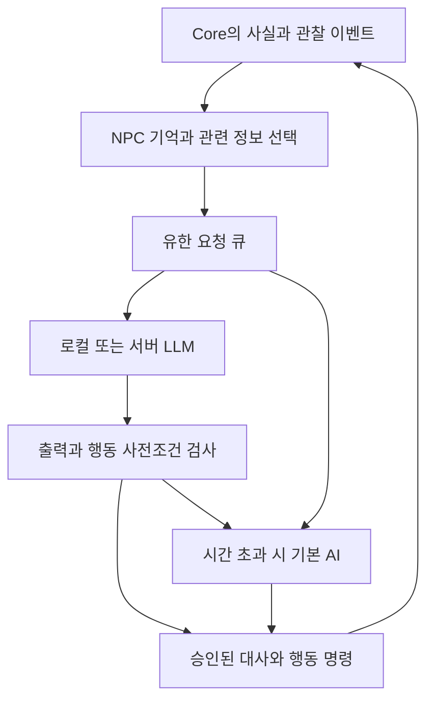

# 오픈월드 NPC의 LLM 도입 검토와 구현 계획

검토일: 2026-10-08 UTC. 기준: M2-04 + M2-05 저장 구현. **설계 제안이며 모델 실행·GPU 성능·NPC LLM 기능 구현을 완료한 문서가 아니다.**

## 판단

LLM 도입은 타당하다. 목표는 플레이어를 기억하고 상황에 맞게 대화하며 자기 목표에 따라 행동하는 NPC다. 모델 연결만으로 초지능·정확한 장기 추론·무제한 자율성을 보장할 수는 없다. 기억·관찰 범위·성격·목표·허용 행동·실패 시 기본 AI를 함께 만들어야 한다.

채택 방향은 **기본 게임은 LLM 없이 완전하게 실행 + 선택 설치하는 로컬 NPC 모델 + 추후 선택적 서버 추론**이다. 핵심 게임 진행을 원격 API에 의존시키지 않는다. 모델은 NPC마다 하나씩 띄우지 않고 한 추론 프로세스의 가중치를 공유하며 NPC별 기억과 요청을 분리한다. 일반 사용자에게 Python·Docker·Ollama·SDK의 수동 설치를 요구하지 않는 배포를 목표로 한다.

LLM은 대화와 장기 행동 계획을 제안한다. 이동·경로 찾기·전투 회피·공격·거래·보상·퀘스트 상태 변경은 기존 Core와 후속 행동 실행기가 판정한다. 추론 때문에 25Hz 시뮬레이션을 기다리게 하지 않는다. 모델 실패나 메모리 부족 시 기존 대사/일정/행동으로 전환하고 저장·전투·이동은 계속된다.

## 현재 코드와의 간격

현재 `WorldNpc`는 마을의 비전투 표식 하나이며 `GameWorld.Interact`의 고정 퀘스트 흐름을 사용한다. NPC 이동·욕구·직업·관계·대화 기록·네트워크·LLM 호출은 없다. 월드는 1인/8개 사전 로드 지역이고 비활성 지역은 정지한다. 따라서 “LLM만 붙이면 오픈월드 완성”으로 처리하지 않는다.

M2-05는 규칙 v4의 지역·퀘스트·아이템·예약 입력을 직접 저장/복원한다. 아직 NPC 기억 필드는 없다. 이후 NPC 데이터를 추가할 때 저장 스키마·콘텐츠 버전을 올리고 명시적 변환기를 도입한다. 지금의 미지 필드/미지원 버전 거부를 임의로 해제해 호환된 것처럼 만들지 않는다.

## 역할과 데이터 흐름



초기 구현 파일은 목적이 분명한 소수로 유지한다. Core에는 NPC 상태·행동 계약만 두고 HTTP/모델 SDK를 참조하지 않는다. 필요 시 엔진 없는 `OpenD2.Npc` 프로젝트 하나에 `NpcMindService`(요청/기억), `INpcModel`(추론 어댑터), `NpcDecisionGate`(검증)를 둔다. MVP에서 복잡한 에이전트 프레임워크·벡터 DB 서버·도구 플러그인 체계를 먼저 도입하지 않는다. Godot는 대화 UI와 표시, 호스트는 판정과 수명 관리에 집중한다.

| 기능 | 기본 방식 | LLM이 하는 일 | 최종 권한 |
|---|---|---|---|
| 이동·경로·전투 | 상태 머신/Utility AI·경로 탐색 | 전술적 목표 제안까지 | Core/호스트 |
| 대화 | 고정 대사와 퀘스트 사실 | 말투·설명·상황 반응 | 검증된 대사만 표시 |
| 하루 일정·직업 | 데이터 기반 계획 실행 | 제한된 목적지/행동의 순서 제안 | 계획 검증기 |
| 관계·평판 | 실제 이벤트에서 수치 갱신 | 감정 표현·해석 제안 | 이벤트 규칙 |
| 퀘스트 | 사전 정의 조건·보상 | 허용된 퀘스트 템플릿/대사 제안 | 퀘스트 시스템 |
| 경제·아이템 | 재고·가격·원자적 거래 | 협상 표현·거래 제안 | 거래 시스템 |
| 세계 사건 | 지역 상태·스케줄러 | 제한된 사건 후보 생성 | 예산·조건 검사기 |

공격/이동을 매 tick 모델에 묻거나 모든 NPC가 서로 무제한 대화하는 구조는 채택하지 않는다. 허용된 고수준 행동도 현재 구현된 실행기가 생기기 전에는 응답 스키마에 넣지 않는다.

## NPC 기억과 지식

각 NPC에 안정적인 `NpcId`, 역할·성격·장기 목표, 현재 계획, 플레이어별 관계, 기억 목록을 둔다. 세계 전체의 비밀을 프롬프트로 보내지 않는다.

- **확정 사실**: Core가 만든 사건 ID, 발생 tick/지역, 관찰자, 출처. 처치·거래·보상 사실을 모델이 생성하거나 수정하지 못한다.
- **경험 기억**: 누가 언제 무엇을 했는지, 중요도와 보존 정책. 실제로 보거나 전달받은 범위만 기록한다.
- **추론·소문**: 출처와 불확실성/전달 횟수를 따로 저장한다. 모델 요약을 확정 사실로 승격하지 않는다.
- **요약**: 중복 제거·오래된 일상 사건 압축. 관련도 + 최근성 + 중요도로 제한된 기억을 선택한다. 처음에는 키워드/태그/관계 점수로 시작하고 임베딩의 효과가 실측될 때 추가한다.
- **보존 한도 제안**: NPC당 최근 사건 64건, 중요 기억 32건, 요약 2KiB, 플레이어 관계 32건으로 시작한다. 초과 시 우선순위/만료 정책을 적용하고 중요 퀘스트 사실은 별도 Core 상태에서 조회한다. 수치는 성능 실측 전 잠정값이다.

예: 플레이어가 구해준 상인은 사건 ID를 기억해 감사 대사를 한다. 할인을 제안할 수 있지만 가격 하한·재고·횟수는 상점 규칙이 승인한다. 단순히 “내가 구해줬다”는 플레이어 채팅만으로 보상 사실이 생기지 않는다.

## 명령 경계와 늦은 응답

요청에는 호스트가 정한 요청 ID, 세션 세대, NPC ID, 지역 활성화 세대, 세계 revision, 허용 행동 목록, 만료 tick/시간을 붙인다. 모델 출력은 허용 enum과 ID, 길이 제한이 있는 JSON으로 받는다. JSON 형식이 맞아도 의미가 틀릴 수 있으므로 독립 검증이 필수다.

예시 계약(후속 NPC MVP의 제안):

```json
{
  "speech": "지하실을 정리해 주셨군요. 고맙습니다.",
  "action": "OfferKnownQuest",
  "targetId": 10,
  "questId": "clear-cellar",
  "evidenceEventIds": [204]
}
```

NPC와 플레이어의 권한/정체성은 응답의 자기 선언이 아니라 요청 컨텍스트에서 결정한다. 대상 존재·거리·지역·생존·퀘스트 단계·허용 템플릿·재고/비용·이벤트 근거를 다시 검사한 후 제한된 명령으로 변환한다. 보상 금액, 아이템 정의, 스크립트, 파일 경로, SQL, 셸 실행을 모델이 정하지 않는다.

동일 request ID는 한 번만 적용한다. NPC 사망·지역 해제·저장 불러오기·세션 종료 시 세대를 바꾸고 관련 요청을 취소한다. 취소가 실제 추론을 즉시 멈추지 못하더라도 늦은 결과는 적용하지 않는다. revision이 바뀌면 행동 사전조건을 재검증하며 민감한 제안은 폐기한다. 플레이어 입력·책·아이템 설명·NPC 기억 속 문장은 비신뢰 데이터이며 시스템 지침이나 실행 권한으로 취급하지 않는다.

협동에서는 호스트만 행동을 승인한다. 클라이언트 로컬 모델이 만든 장비·보상·퀘스트 변경을 서버가 그대로 수용하지 않는다. NPC 대사의 표시와 실제 거래/보상을 분리하고 확정 UI에는 Core 결과만 표시한다.

## 오픈월드 규모와 부하 제어

| 계층 | 대상 | 처리 |
|---|---|---|
| 직접 상호작용 | 대화 중 NPC | 이벤트 기반 LLM, 높은 우선순위 |
| 가까운 활동 | 같은 관심 영역의 NPC | 기본 AI; 중요한 사건·계획 무효화 시만 추론 |
| 먼 지역 | 플레이어가 없는 활성 세계 | 직업/경제/일정의 저빈도 요약 시뮬레이션; 일상 LLM 호출 없음 |
| 휴면 지역 | 해제된 지역 | 상태/기억만 저장, 호출 없음; 재진입 시 요약 시간 진행 |

초기 로컬 예산은 동시 추론 1개, 대기 4개, NPC별 진행 요청 1개로 제안한다. 대화가 계획 요청보다 우선하며 오래된 계획 요청은 병합/폐기한다. 중요한 NPC가 대기열을 독점하지 않도록 NPC별 간격·공정성·최대 대기 시간을 적용한다. 대화는 입력 직후 반응 UI를 표시하고 8초 내 완료하지 못하면 기본 대사를 사용한다. 행동 계획은 15초 만료, 재계획은 사건 발생 시 또는 최소 60초 간격으로 시작한다. 모두 실측 후 조정할 잠정 정책이다.

한 요청의 입력 상한 2,048 tokens, 출력 상한 192 tokens로 시작하며 길이 제한은 모델 tokenizer로 계산한다. 지역·NPC·요청별 토큰/시간 예산을 기록한다. NPC마다 전체 대화 기록을 무한히 붙이지 않는다. 고정 세계관 프리픽스를 공유할 수 있지만 개인 기억/비밀이 다른 요청의 출력에 섞이지 않도록 캐시 키와 접근 범위를 분리한다. KV 캐시는 영속 NPC 기억이 아니다.

**부하 예시(측정값이 아닌 산식)**: 플레이어당 NPC 16명이 평균 60초에 한 번, 입력 1,024/출력 128 tokens를 요청하면 약 0.267 req/s, 입력 273 tok/s·출력 34 tok/s가 필요하다. 플레이어 100명이 같은 방식이면 약 26.7 req/s·출력 3,413 tok/s다. 대화 호출은 별도 가산한다. 모든 NPC에 이 빈도를 기계적으로 적용하는 것이 아니라 호출을 줄일 필요를 보여주는 상한 검토 예시다.

서버 비용은 `요청 수 × (입력 tokens × 입력 단가 + 출력 tokens × 출력 단가) / 1,000,000`에 GPU 유휴/중계/저장/관측 비용을 더해 계산한다. 공급자별 실제 단가를 넣기 전 금액을 확정하지 않는다. 로컬 실행은 중앙 추론 비용을 줄이지만 사용자 CPU/GPU·RAM·전력·모델 다운로드 비용이 생긴다. “서버 부하 0”과 “고품질 LLM 상시 실행”을 동시에 약속하지 않는다.

## 실행 방식과 모델 선택

| 방식 | 장점 | 비용/제약 | 판단 |
|---|---|---|---|
| 기본 AI만 | 가장 작은 설치, 완전 오프라인 | 자유 대화 제한 | 기본 배포 필수 |
| 선택형 로컬 llama.cpp | 양자화 모델, 로컬 CPU/GPU, 별도 SDK 설치 없는 번들화 후보 | 모델 파일·메모리·그래픽 렌더링과 자원 경쟁 | 첫 실험 후보 |
| 운영 서버 vLLM | 서버에서 공유 모델·다중 요청 처리, 구조화 출력/프리픽스 캐시 | 운영 GPU·보안·네트워크·지연 | 협동/서비스 수요와 실측 이후 |
| 외부 모델 API | 배포 크기 작고 고급 모델 비교 쉬움 | 종량제·네트워크·키 보호·서비스 중단 | 개발 평가/선택 기능 후보 |

특정 최신 모델을 지금 확정하지 않는다. 한국어 NPC 대화와 행동 스키마 정확도, 목표 PC의 렌더링 병행 성능, 배포 라이선스를 함께 비교한다. 평가군은 작은 1~4B급 양자화 모델, 품질 비교용 7~8B급, 고급 API 기준 모델로 잡되 같은 시나리오·토큰 예산으로 비교한다. 단순 가중치 산식상 4bit의 3B는 약 1.5GB, 8B는 약 4GB이며 메타데이터·KV·작업 공간·게임 메모리가 더 필요하다. 이것은 최소 실행 RAM이나 다운로드 용량 보장이 아니다.

로컬 모델 배포 시 앱 안에서 선택 다운로드, 크기/권장 사양 안내, hash 검증·중단 재개·롤백·제거를 제공한다. 선택하지 않으면 모델을 다운로드하지 않는다. 엔진/모델 커밋 또는 릴리스와 라이선스·재배포 조건을 고정하고 기존 native 의존성처럼 소스 빌드/출처를 GitHub에서 추적한다. 모델 가중치는 Git 저장소에 넣지 않는다. 추론 서비스는 기본 loopback에만 바인딩하고 무작위 세션 자격 증명을 사용한다. 외부 API 키를 클라이언트 바이너리에 넣지 않는다.

## 저장·복원·재생

NPC 기억·관계·승인된 계획·실행 위치는 세계 체크포인트와 같은 세대/트랜잭션으로 저장한다. 요약은 원본 사건 ID를 참조하며 새로 요약했다고 게임 사실이 바뀌지 않는다. 단순한 sidecar 파일을 별도로 덮어써 세계 상태와 기억이 어긋나지 않게 한다. 오래된 세이브의 기억 변환 실패 시 임의로 삭제하지 않고 호환성 오류/명시적 복구 정책을 사용한다.

LLM을 동일 seed로 다시 호출해도 같은 출력이 나온다고 가정하지 않는다. 재생에서는 모델을 다시 부르지 않고 **승인된 대사/행동, 적용 tick, 요청 ID, 콘텐츠·모델·프롬프트 버전**을 재생한다. 플레이어의 원문 대화를 로그에 무조건 남기지 않으며 보존/삭제 정책과 비밀 정보 제거를 적용한다. 진행 중 추론 요청은 저장하지 않고 로드 시 새 세대로 재평가한다.

## 단계별 작업과 종료 조건

| 작업 | 선행 | 구현/검증 | 완료 기준 |
|---|---|---|---|
| NPC-01 | M2-05 | 1 NPC 대화, 3개 허용 의도, 가짜 모델/응답 지연/실패 테스트 | Core tick 무대기, 부정 행동 0건 적용, fallback 정상 |
| NPC-02 | NPC-01 | 로컬 어댑터 하나, 한국어 모델 비교, 선택 다운로드 | 목표 PC에서 배포·메모리·지연·렌더링 병행 예산 통과 |
| NPC-03 | NPC-02, NPC 상태 모델 | 사건 기억·관계·목표·제한 계획, 저장 스키마 변환 | 재접속/로드·중복 응답·오래된 계획·요약 왜곡 방지 |
| NPC-04 | NPC-03, M6 기반 | 10/50/200 NPC 관심 영역과 휴면, 호출 공정성 | 1시간 큐/메모리 상한 유지, 지역 이동 시 누수 0 |
| NPC-05 | M5 권한 호스트 | 서버 어댑터·다중 플레이어 관찰 권한·비용 예산 | 무권한 거래/보상 0, 지연/장애 fallback, 비용 상한 준수 |

M3의 시각 고도화와 NPC-01 연구는 분리해 진행할 수 있다. 오픈월드 경제·NPC 사회관계 전체를 M2 완료 조건에 한 번에 넣지 않는다. 먼저 Camp Guide 한 명에게 제한된 대화 능력을 붙여 검증한 뒤 확장한다.

### 검증 데이터와 잠정 인수 기준

- 한국어 시나리오 100개: 정상 대화, 이전 행동 회상, 잘못된 주장, 불가능한 이동/거래, 보상 중복 요구, NPC/지역 제거, 다중 플레이어 비밀, 지침 덮어쓰기 시도, 길이 초과/잘못된 JSON, 시간 초과. 정상·공격·실패 시나리오 비율을 고정한다.
- 모델별 고정 프롬프트/출력 상한, 모델 hash·양자화·컴퓨터 사양을 기록한다. 외부 API와 로컬을 같은 GPU TPS처럼 비교하지 않는다.
- 하드 게이트: 무권한 상태 변경 0건, 중복/만료 응답 적용 0건, 저장 후 사실/관계 복원 100%, 1시간 실행 시 대기열/메모리 상한 유지. 통계적 시험 통과가 모든 공격의 부재를 증명하지는 않는다.
- 품질 목표: 평가자가 표시한 사실 모순/비밀 유출을 별도 집계; 한국어 자연스러움/캐릭터 일관성은 블라인드 평가. “똑똑해 보인다”만으로 인수하지 않는다.
- 성능 목표(아직 미측정): 기본 게임 대비 NPC 조정기의 추가 tick p99 0.2ms 이하, 렌더링 p95 악화 10% 이내, 대화 첫 토큰 p95 2.5초 이하·전체 8초 이내. 미달이면 토큰/동시성/모델 크기를 낮추고 기본 AI를 유지한다.
- 관측: 요청/초, 입력/출력 tokens, queue wait·TTFT·전체 지연, 취소/폐기/캐시 비율, CPU/GPU/RAM/VRAM, 게임 frame/tick p95/p99, 시간당 실제 비용. 성공 사례 영상과 실패 원문을 함께 남긴다.

## 조사 근거와 적용 한계

1. [Generative Agents 논문](https://arxiv.org/abs/2304.03442): 기억·계획·성찰을 결합한 25 에이전트 샌드박스 연구다. NPC 구조의 근거이며 대규모 실시간 액션 게임의 성능이나 초지능 증명이 아니다.
2. [llama.cpp server 공식 문서](https://github.com/ggml-org/llama.cpp/blob/master/tools/server/README.md): CPU/GPU 양자화 추론, 병렬 디코딩·연속 배칭, JSON schema 출력 등을 제공한다. 실제 모델별 한국어 품질/스키마 준수·장치 호환성은 별도 시험한다.
3. [vLLM Structured Outputs](https://docs.vllm.ai/en/latest/features/structured_outputs/): 구조화 출력 지원을 제공한다. 형식 준수와 게임 규칙의 의미적 타당성은 별개다.
4. [vLLM Prefix Caching](https://docs.vllm.ai/en/latest/design/prefix_caching/): 공통 prefix의 KV 재사용을 위한 설계다. 캐시가 대화 기억·접근 제어·추론 비용 제거를 대신하지 않는다.

공식 문서/논문을 2026-10-08에 확인했다. 이 문서의 예산·아키텍처·로드맵은 위 자료를 참고한 프로젝트 설계 판단이며 아직 벤치마크 결과가 아니다. 실행 환경을 고르는 NPC-02에서 버전과 모델 재배포 조건을 다시 확인한다.
